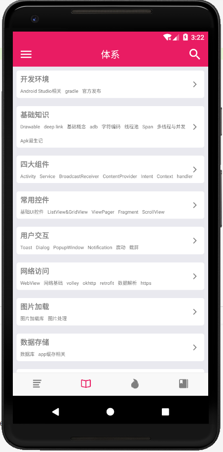
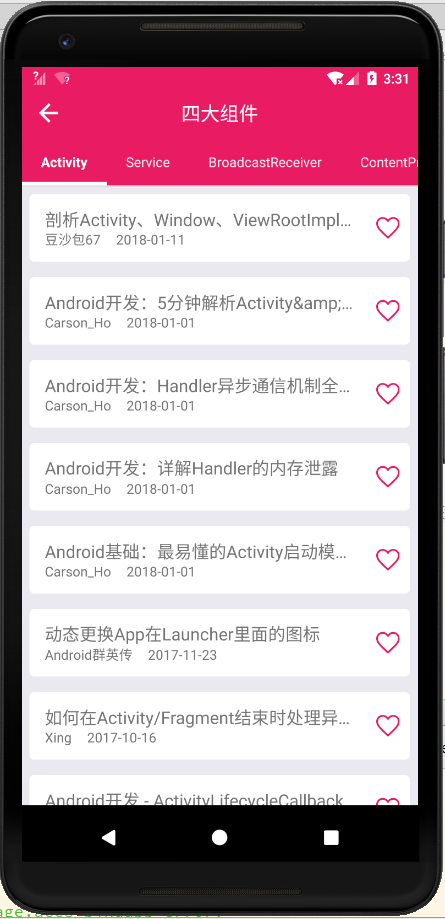
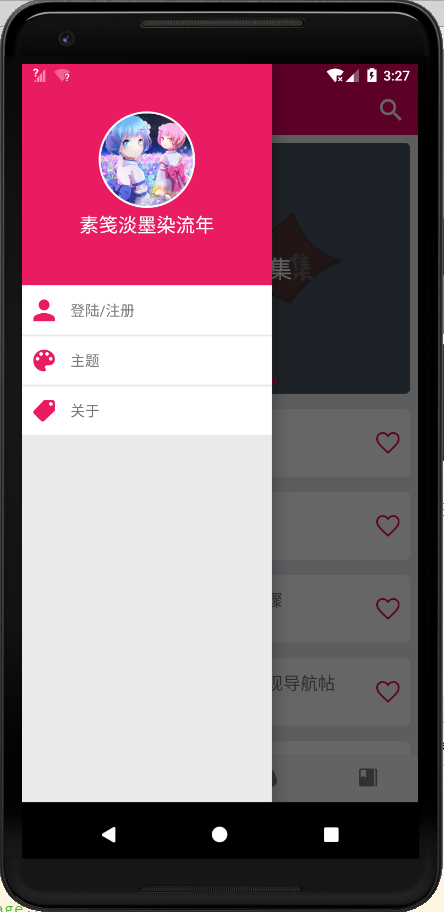
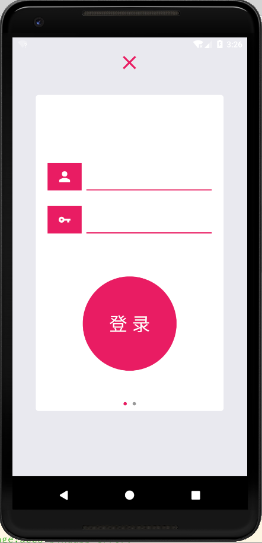
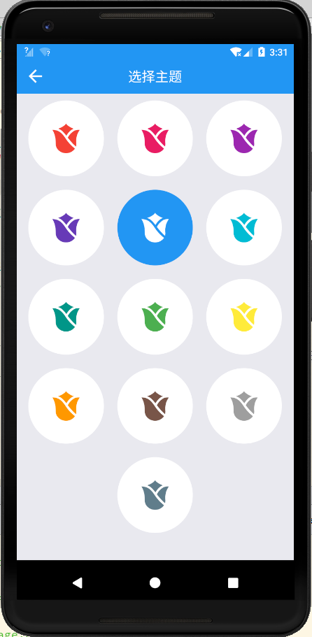

# rn-wanandroid
## 此项目是练习RN之作，因为公司有事，项目可能会闲置一段时间，里面的bug、细节来不及修复与完善，多多包涵。

此项目是鸿神wanandroid的一个客户端，[地址 http://wanandroid.com/](http://wanandroid.com/)，一个致力于分享各种Android干货的平台。

## 项目依赖

可以直接从github搜索名字看到依赖详细信息。

```
"@monterosa/react-native-parallax-scroll": "^1.5.3",
"merge-stream": "^1.0.1",
"react": "16.0.0",
"react-native": "0.50.3",
"react-native-awesome-alerts": "^1.0.6",
"react-native-banner-carousel": "^1.0.2",
"react-native-easy-toast": "^1.0.9",
"react-native-scrollable-tab-view": "^0.8.0",
"react-native-tab-navigator": "^0.3.4",
"react-native-textinput-effects": "^0.4.2",
"react-native-vector-icons": "^4.4.3",
"react-navigation": "^1.0.0-beta.19",
"react-redux": "^5.0.6",
"redux": "^3.7.2",
"redux-actions": "^2.2.1",
"redux-logger": "^3.0.6",
"redux-thunk": "^2.2.0"
```

感谢热爱开源分享的同学们！！！

## 运行

手上没有mac，只用了android作为测试

```
git clone https://github.com/sujianqingfeng/rn-wanandroid.git
cd rn-wanandroid
yarn install // or npm install
react-native run-android
```
## 截图










